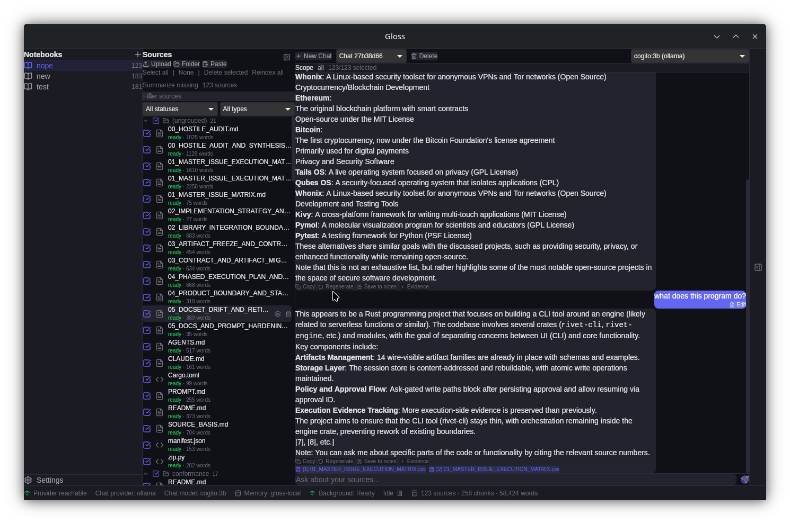

<div align="center">
  
  <h1>Gloss</h1>
  <p><strong>A local-first desktop notebook for source-grounded research and chat.</strong></p>
  <p>
    Import files, organize them into isolated notebooks, ask questions with local or explicitly configured cloud models,
    and inspect the evidence and runtime receipts behind each answer.
  </p>
</div>



> [!IMPORTANT]
> Gloss is under active development and currently ships as a source build. Linux x86_64 is the maintained packaging target. The repository does not yet publish a tagged, end-user binary release, and live GUI/installed-workflow certification is still incomplete.

## Why Gloss exists

Most document-chat tools hide the retrieval path that produced an answer. Gloss keeps that path visible.

A Gloss notebook owns its source files, SQLite data, conversations, notes, vector artifacts, and receipts. Chat can run against all sources, an explicit selection, or no retrieval context. When dense retrieval or semantic memory is unavailable, Gloss records the fallback instead of presenting it as an equivalent result.

Gloss is designed around four boundaries:

- Local data is the default. Notebook state is stored on the machine, not in a Gloss service.
- Network use is explicit. Local providers use loopback by default; LAN and custom cloud endpoints require operator opt-in.
- Evidence is inspectable. Citations, source scope, prompt metadata, decoding settings, retrieval decisions, and generation status are available in the desktop inspector.
- Degradation is disclosed. Missing indices, optional tools, or model capabilities produce reason codes, disabled paths, or bounded fallbacks.

## What works today

### Notebooks and sources

- Create, rename, switch, and delete isolated notebooks.
- Import individual files, folders, pasted text, URLs, and public YouTube caption tracks.
- Track extraction, chunking, embedding, indexing, and background-job state per source.
- Review failed imports and retry, quarantine, or delete them.
- Export and validate portable `.glosspkg.tar.gz` notebook archives with per-file SHA-256 hashes and a package manifest.

### Source-grounded chat

- Stream responses from Ollama, llama.cpp, OpenAI, or Anthropic.
- Chat with every ready source, a selected subset, or no source context.
- Combine SQLite FTS5/BM25 and local HNSW dense retrieval, then fuse candidates with reciprocal-rank fusion.
- Use bounded multi-angle query rewriting when a provider is available; failure returns to the original query.
- Persist partial, cancelled, errored, and completed chat outcomes instead of leaving the interface in an indefinite loading state.
- Inspect citations, retrieval mode, fallback reason codes, prompt digests, decoding settings, and generation receipts.

### Notes and Studio

- Create, edit, pin, and delete notebook-scoped notes.
- Save useful chat responses as notes.
- Generate source-bound reports, summaries, outlines, FAQs, flashcards, quizzes, mind maps, timelines, comparison tables, and action plans from the current source scope.
- Export Studio artifacts as JSON with a digest-bearing export receipt.

### Diagnostics and recovery

- Test provider connectivity and inspect model availability.
- Check embedding, dense-index, semantic-memory, and TurboQuant runtime status.
- Run database doctor checks for missing notebook data, source-count drift, orphaned rows, failed imports, and stale jobs.
- Rebuild supported vector artifacts from the settings interface.

## Source support

The import capability matrix lives in [`src-tauri/src/ingestion/import_capability.rs`](src-tauri/src/ingestion/import_capability.rs). The short version:

| Input | Current behavior |
| --- | --- |
| Text, Markdown, reStructuredText, code, and config files | Local UTF-8 extraction with format or language metadata |
| CSV and TSV | Imported as plain text; table normalization is not claimed |
| PDF | Bounded local text extraction; no OCR, forms, or layout fidelity |
| DOCX, XLSX, and PPTX | Bounded OOXML text/value extraction; no rendering fidelity |
| Legacy DOC, XLS, and PPT | Optional local `antiword`, `xls2csv`, and `catppt` commands with timeout and redacted tool receipts |
| EPUB | Bounded local spine/XHTML text extraction; no DRM support |
| HTML files | Imported as source text; readability extraction is not applied |
| URL | One explicitly requested HTTP(S) fetch with host, redirect, content-type, timeout, and byte limits; no crawling or authenticated fetch |
| YouTube | Public caption tracks only, with per-import network consent; no video download |
| Images | Routed to a configured vision-capable model; quality depends on that model |
| Audio | `ffprobe` metadata plus optional transcription when a compatible Whisper CLI and local model are already available |
| Video | Bounded `ffmpeg`/`ffprobe` processing; full video understanding and general transcription are not claimed |

Archive files and opaque binary/model formats are rejected as ordinary sources.

## Providers and network boundaries

| Provider | Default endpoint | Default policy |
| --- | --- | --- |
| Ollama | `http://localhost:11434` | Loopback only |
| llama.cpp | `http://localhost:8080/v1` | Loopback only |
| OpenAI | `https://api.openai.com/v1` | Official HTTPS host only |
| Anthropic | `https://api.anthropic.com/v1` | Official HTTPS host only |

RFC1918 LAN endpoints for local providers require `allow_lan_local_providers`. Custom OpenAI or Anthropic HTTPS endpoints require `allow_custom_cloud_endpoints`. Provider URLs reject embedded credentials, query strings, and fragments.

API keys are stored in a local AES-256-GCM encrypted file. On Unix, Gloss applies owner-only permissions to the secret directory, key, and ciphertext. This is application-managed local encryption, not an operating-system keyring. Anyone who can read both the key file and ciphertext under the same user account can decrypt the stored secrets.

Gloss has no product telemetry or hosted synchronization service in the current source. Network traffic still occurs when you:

- use OpenAI, Anthropic, a LAN model server, or a custom cloud endpoint;
- import a URL or YouTube transcript;
- allow the first download of a local embedding model;
- use a model-backed image or summarization workflow through a non-loopback provider.

When a cloud provider is selected, the prompt and any source context assembled for that request leave the machine. "Local-first" does not mean "network impossible."

## Retrieval and proof model

```text
selected notebook + source scope
              |
              v
       extraction/chunking
              |
      +-------+--------+
      |                |
 SQLite FTS5/BM25   local embeddings
      |                |
      |            HNSW/usearch
      +-------+--------+
              |
        RRF candidate fusion
              |
      optional rerank/fallback
              |
       bounded prompt context
              |
         provider stream
              |
 answer + citations + receipts
```

The stable local path uses SQLite FTS5/BM25 and a local HNSW index. The native embedding path uses `nomic-ai/nomic-embed-text-v1.5` through FastEmbed/Candle and requires explicit consent before its first model download.

The semantic-memory backend and TurboQuant candidate sidecars are compiled into the release profile but remain experimental runtime surfaces. TurboQuant is candidate acceleration only; exact reranking remains required. Dependency presence by itself is not treated as runtime proof.

Gloss records structured evidence for important operations, including:

- source scope, backend requested/used, retrieval mode, fallbacks, and degradation markers;
- citation anchors and filtered-citation reasons;
- prompt, context, request, and response digests;
- requested and effective decoding settings;
- generation terminal state and partial-response persistence;
- external-tool invocation status with redacted arguments and bounded output previews;
- notebook and Studio export hashes.

Receipts improve auditability. They do not prove that a model answer is factually correct.

## Build from source

### Prerequisites

The maintained path is Linux x86_64 with:

- Node.js 22 and npm;
- the stable Rust toolchain with `rustfmt`;
- Tauri 2 Linux development libraries;
- a supported model provider, usually a local Ollama or llama.cpp server.

On Ubuntu or Debian, the CI system dependencies are:

```bash
sudo apt-get update
sudo apt-get install -y \
  build-essential curl file \
  libayatana-appindicator3-dev librsvg2-dev libssl-dev \
  libwebkit2gtk-4.1-dev libxdo-dev pkg-config wget
```

Install Rust from [rustup.rs](https://rustup.rs/) and Node.js 22 from your preferred package manager.

### Run the desktop app

```bash
git clone https://github.com/RecursiveIntell/Gloss.git
cd Gloss
npm ci
npm run tauri:dev:release
```

The first embedding-model initialization may request download consent. You can still use no-retrieval chat or BM25-backed paths when dense embeddings are unavailable.

Open Settings to choose a provider and model. Ollama defaults to `http://localhost:11434`; llama.cpp defaults to `http://localhost:8080/v1`. OpenAI and Anthropic require API keys.

### Build the current release profile

```bash
npm run tauri:build:sm-tq
```

Tauri is configured to produce an AppImage. AppImage packaging also needs `squashfs-tools` and the normal Tauri bundler prerequisites.

## Verification

The canonical verifier is:

```bash
npm ci
cargo install cargo-deny --version 0.19.8 --locked
npm run verify
```

It runs, in order:

1. Rust formatting;
2. Tauri command/event contract validation;
3. static repair gates;
4. Cargo checks for the default, semantic-memory, and semantic-memory + TurboQuant profiles;
5. Rust tests for the semantic-memory + TurboQuant profile;
6. frontend unit and contract tests;
7. the production frontend build;
8. Cargo advisory/license/source policy checks;
9. the production npm audit;
10. a debug desktop compile without bundling.

For a faster local diagnostic that deliberately skips desktop compilation:

```bash
npm run verify -- --skip-desktop-compile
```

That command must report `passed_with_skips`. It is not release proof.

Useful focused checks:

```bash
npm run build
npm test
cargo fmt --all -- --check
cargo test --locked --manifest-path src-tauri/Cargo.toml \
  --no-default-features --features semantic-memory-turbo-quant
bash validation/run_all_gloss_repair_gates.sh .
```

The GitHub Actions workflow runs `npm run verify` for pull requests.

## Repository map

```text
src/                       React desktop interface and Zustand stores
src-tauri/src/             Rust/Tauri commands, providers, ingestion, retrieval, and data layer
src-tauri/vendor/          Reviewed local copies of selected RecursiveIntell crates
scripts/                   Build, smoke, replay, and canonical verification entry points
validation/                Static, contract, packaging, and release-consistency gates
docs/                      Current plans, receipts, audits, and archived evidence
fixtures/                   Deterministic import and live-smoke fixtures
```

The primary runtime ownership map is in [`AGENTS.md`](AGENTS.md). Historical audit documents are evidence from specific runs, not a substitute for current source or a fresh verifier receipt.

## Current limitations

- There is no tagged binary release or in-app updater.
- Linux x86_64 is the maintained build and packaging target. Other desktop platforms are not CI-certified here.
- Automated live GUI coverage and installed end-to-end workflow certification remain incomplete.
- PDF and office-document support extracts text and values; it does not preserve visual layout.
- Image, audio, and video paths depend on configured models or optional local tools and are not equally proven across formats.
- Audio-overview generation is not a release-proven user workflow.
- Semantic-memory and TurboQuant controls are experimental. Gloss-local retrieval remains the stable fallback.
- Studio exposes ten output kinds in the current UI; additional backend artifact kinds are not presented as finished user workflows.
- Cloud-provider use sends the assembled request context to that provider.

## Contributing

1. Open an issue describing the user-visible problem, expected behavior, and platform.
2. Keep source-of-truth ownership intact. Do not add shadow stores, duplicate provider policy, or alternate receipt authority.
3. Add behavioral tests for functional changes and contract gates for cross-language IPC or event changes.
4. Run `npm run verify` before requesting review.
5. State any skipped live, packaging, model, or hardware validation in the pull request.

Security-sensitive reports should not include API keys, private source text, local paths, or unredacted receipts in public issues.

## License

Gloss is licensed under the [GNU Affero General Public License v3.0](LICENSE) (`AGPL-3.0-only`).
