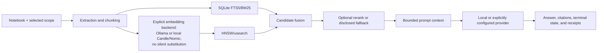

<!-- last-verified: 2026-09-18 -->

# Gloss

<p align="center">
  
</p>

> A local-first desktop notebook for source-grounded research and chat.

Gloss is a source-implemented local-first desktop notebook for source-grounded research and chat. Source/build verification, native desktop execution, provider/model execution, package replay, and a tagged release are separate evidence boundaries.

> [!WARNING]
> Gloss is under active development and currently distributed as source. Linux x86_64 is the maintained development/build target. The repository does not publish a tagged, end-user binary release.
>
> The current source/build verifier covers frontend tests/build, Cargo feature checks/tests, strict Clippy, dependency policy checks, and a Tauri debug compile. Those results do **not** by themselves establish a complete installed workflow, every provider/model configuration, or release-grade behavior.
>
> The repository ships a Linux native WebDriver baseline and an AppImage build/replay gate. Their receipts are run-specific evidence, not implications of source presence. Gloss remains source-distributed: no tagged binary release, signed installer, upgrade workflow, or non-Linux certification is claimed.


*Representative interface screenshot; illustrative only and not evidence of current live desktop or release behavior.*

## Contents

- [Who Gloss is for](#who-gloss-is-for)
- [What is verified](#what-is-verified)
- [Quick start](#quick-start)
- [What the source implements](#what-the-source-currently-implements)
- [Source and provider boundaries](#source-and-provider-boundaries)
- [Architecture](#architecture)
- [Build and development](#build-and-development)
- [Verification](#verification)
- [Repository map](#repository-map)
- [Known limitations](#known-limitations)
- [Contributing and security](#contributing-and-security)
- [License](#license)

## Who Gloss is for

Gloss is for people who want a source-implemented local notebook that makes the intended path from imported source to model response inspectable.

It is a good fit when you want:

- notebook-scoped source files, conversations, notes, and receipts;
- explicit `all`, `selected`, or `none` retrieval scope;
- local FTS/BM25 and dense retrieval with disclosed degradation;
- local or explicitly configured remote provider paths, subject to provider availability and network consent; live-model coverage is narrow and run-specific;
- structured Studio outputs tied to the current source scope;
- a desktop interface backed by Rust/Tauri rather than a hosted Gloss service.

It is **not** currently a packaged end-user release, a hosted synchronization service, a formal security/compliance product, or a substitute for validating model answers.

## What is verified

The evidence states below are deliberately separate:

| Surface | State in this snapshot | Boundary |
| --- | --- | --- |
| Frontend unit and contract tests | **Verified-executed** | The current canonical verifier runs the complete Vitest and static-contract suites |
| Frontend production build | **Verified-executed** | `npm run build` passed; Vite emitted a non-blocking chunk-size advisory |
| Rust default, semantic-memory, and TurboQuant profiles | **Verified-executed** | Cargo checks passed for all three profiles |
| Rust test matrices | **Verified-executed** | Application, native-owner, and TurboQuant harness tests pass; explicitly environment-dependent live-model tests remain separate |
| Strict Clippy | **Verified-executed** | `-D warnings` passed for the TurboQuant profile |
| Dependency policy | **Verified-executed** | Rust advisories/licenses/sources and both production and development npm audits pass for the locked candidate |
| Tauri debug desktop compile | **Verified-executed** | `npm run verify` built `target/debug/gloss` without bundling |
| Native desktop baseline | **Run-specific** | A real Tauri/WebKit driver is shipped and required in CI; a workflow result applies only to its exact candidate |
| AppImage packaging | **Run-specific** | The locked builder and extracted-payload replay gate are shipped; this is not a tagged, signed, or installed release |
| Installed package workflow | **Not release-certified** | Launch/replay evidence does not establish system installation, upgrade, rollback, or distribution signing |
| Real provider/model chat | **Narrow scope only** | Transport contracts are automated; any live endpoint/model result applies only to the named runtime and model digests |
| Offline cached Nomic embedding smoke | **Environment-dependent** | The model is not bundled; this gate requires an independently identified local cache |
| Other desktop operating systems | **Not verified in this snapshot** | No CI, packaging, or live-runtime evidence is provided here for non-Linux platforms |

The canonical release projection remains `release_ready: false` and `public_claim_ready: false` until tagged-artifact, installed-workflow, and independent-reproduction gates are satisfied.

## Quick start

### 1. Install prerequisites

The verified CI development path uses:

- Node.js 22 and npm;
- the repository-pinned Rust 1.98.1 toolchain with `rustfmt` and `clippy`;
- Tauri 2 Linux development libraries;
- a configured provider for interactive model-backed chat.

On Ubuntu/Debian, the repository's Linux CI path installs this system set. This does not certify other distributions, desktop platforms, or installed workflows. Review system-package changes before running them:

```bash
sudo apt-get update
sudo apt-get install -y \
  build-essential curl file \
  libayatana-appindicator3-dev librsvg2-dev libssl-dev \
  libwebkit2gtk-4.1-dev libxdo-dev pkg-config wget
```

Install Rust through [rustup](https://rustup.rs/) and use Node.js 22 from your preferred package manager or runtime manager.

### 2. Clone and install JavaScript dependencies

```bash
git clone https://github.com/RecursiveIntell/Gloss.git
cd Gloss
npm ci
```

### 3. Reach a deterministic first success

Run the repository-owned verifier:

```bash
npm run verify
```

A full run with no skipped gates ends with a JSON receipt whose status is `"passed"`. This status covers the listed source/build/dependency gates only.

### 4. Start the desktop app

```bash
npm run tauri:dev:release
```

This command launches a Tauri development app using the `semantic-memory-turbo-quant` feature profile. Native UI and provider behavior remain environment-dependent; use the repository-owned live driver when you need a receipt-bound baseline.

Open Settings to select a provider and model. Chat can use no retrieval context, but interactive model-backed chat still requires a configured provider and model.

## What the source currently implements

The following are source-declared paths. They are covered by the repository's build/tests/static gates to varying degrees, but they have not all been live-smoke tested in this snapshot.

### Notebooks and sources

- Isolated notebook directories containing source files, SQLite state, conversations, notes, vector artifacts, and receipts.
- Source-declared ingestion paths include individual files, folders, pasted text, URLs, public YouTube caption tracks, images, audio, video, and documents.
- Source lifecycle, extraction/chunking state, background jobs, failed-import review, retry, quarantine, and deletion.
- Portable `.glosspkg.tar.gz` notebook archives with manifest and per-file SHA-256 validation.

### Source-grounded chat

- Source-level provider adapters exist for Ollama, llama.cpp, OpenAI, and Anthropic. Automated transport contracts do not turn one live endpoint/model run into proof for every provider.
- `all`, explicit selected-source, and `none` retrieval scope.
- SQLite FTS5/BM25 and local HNSW dense retrieval with reciprocal-rank fusion.
- Bounded query rewriting with fallback to the original query when refinement is unavailable.
- Partial, cancelled, errored, and completed attempt persistence.
- Replayable chat events and visible evidence, fallback, citation, decoding, prompt, and generation receipts.

### Notes and Studio

Source-level Studio paths define structured outputs and deterministic fallback artifacts. Their live model-backed execution is not verified in this snapshot; deterministic fallback paths are covered by source/build tests.

- Notebook-scoped notes, saved responses, pinning, editing, and deletion.
- Source-bound structured outputs such as reports, summaries, outlines, FAQs, flashcards, quizzes, mind maps, timelines, comparison tables, action plans, study guides, slide-style outputs, infographics, and audio-overview scripts.
- JSON export with digest-bearing Studio receipts.
- Deterministic fallback artifacts when LLM refinement is unavailable or validation fails.

### Diagnostics and recovery

- Provider connectivity and model-list checks.
- Embedding, dense-index, semantic-memory, and TurboQuant diagnostics.
- Database doctor checks for source-count drift, orphan rows, failed imports, stale queue jobs, and missing notebook state.
- Vector-artifact rebuild paths and redacted external-tool receipts.

## Source and provider boundaries

### Import capability matrix

The canonical source owner is [`import_capability.rs`](src-tauri/src/ingestion/import_capability.rs). Unknown, archive, binary, and model formats are not silently widened into text import.

| Input | Behavior | Boundary |
| --- | --- | --- |
| Text, Markdown, reStructuredText, code, config | Local UTF-8 extraction with format/language metadata | Source text is not automatically summarized or normalized |
| CSV/TSV | Plain-text import | Table normalization is not claimed |
| PDF | Bounded local extraction | OCR, forms, and layout fidelity are not claimed |
| DOCX/XLSX/PPTX | Bounded OOXML text/value extraction | Rendering fidelity is not claimed |
| Legacy DOC/XLS/PPT | Optional `antiword`, `xls2csv`, and `catppt` tools | Timeout, output-size, and redacted receipt boundaries apply |
| EPUB | Bounded spine/XHTML extraction | DRM and layout fidelity are not supported |
| HTML files | Source-text import | Readability extraction is not applied |
| URL | One consented HTTP(S) fetch | Public-host, redirect, content-type, timeout, and byte limits; no crawling/authenticated fetch |
| YouTube | Public caption tracks only | Per-import network consent; no video download or authenticated access |
| Images | Vision-job route | Quality depends on the configured vision-capable model |
| Audio | `ffprobe` metadata plus optional cached Whisper transcription | Transcription is skipped unless a compatible local model is already cached |
| Video | Bounded `ffmpeg`/`ffprobe` processing | Full video understanding and general transcription are not claimed |

### Providers

| Provider | Default endpoint | Default policy |
| --- | --- | --- |
| Ollama | `http://localhost:11434` | Loopback only |
| llama.cpp | `http://localhost:8080/v1` | Loopback only |
| OpenAI | `https://api.openai.com/v1` | Official HTTPS host; custom endpoint requires opt-in |
| Anthropic | `https://api.anthropic.com/v1` | Official HTTPS host; custom endpoint requires opt-in |

RFC1918 LAN endpoints for local providers require `allow_lan_local_providers`. Custom OpenAI/Anthropic HTTPS endpoints require `allow_custom_cloud_endpoints`. Provider URLs reject embedded credentials, query strings, and fragments.

API keys are stored in an application-managed AES-256-GCM encrypted file. On Unix, Gloss applies owner-only permissions to the secret directory, key, and ciphertext. This is not an operating-system keyring; a user who can read both the key and ciphertext under the same account can decrypt the secrets.

Gloss has no hosted synchronization service in the current source. Network activity still occurs when you:

- use OpenAI, Anthropic, a LAN model server, or a custom cloud endpoint;
- import a URL or YouTube transcript;
- permit a first-use local embedding-model download;
- use model-backed image or summarization workflows through a non-loopback provider.

When a cloud provider is selected, the assembled prompt and source context leave the machine. “Local-first” does not mean “network impossible.”

## Architecture



The text equivalent is: notebook scope controls which source records enter extraction; FTS/BM25 and optional dense HNSW search produce candidates; Gloss fuses or degrades those candidates; the prompt is bounded; the provider returns a stream; and the answer is persisted with citations and runtime evidence.

### Retrieval and evidence ownership

```text
source scope -> extraction/chunking -> FTS + dense candidates
       -> fusion/rerank/fallback -> bounded prompt -> provider stream
       -> persisted response + citations + receipts
```

The frontend renders backend-owned attempt, source-scope, retrieval, and terminal state. It does not invent cancellation completion or silently widen an invalid selected-source scope.

## Build and development

### Useful scripts

| Command | Purpose | Evidence boundary |
| --- | --- | --- |
| `npm run dev` | Vite frontend development server | Does not launch the Tauri desktop shell by itself |
| `npm run tauri:dev:release` | Tauri development app with the release feature profile | Live GUI behavior remains environment-dependent |
| `npm run build` | TypeScript check plus production Vite build | Frontend build only |
| `npm test` | Frontend unit and static contract tests | Does not prove live Tauri interaction |
| `npm run verify` | Canonical source/build verification | Checks static gates, Cargo profiles/tests, frontend tests/build, cargo-deny, npm audit, and a debug Tauri compile; it does not prove AppImage packaging, live GUI behavior, or provider/model execution |
| `npm run desktop-smoke` | Scripted runtime/evidence contract harness | Validates supplied receipts; headed proof requires `scripts/live_desktop_smoke.py` |
| `npm run installer-smoke` | Locked AppImage build and extracted-payload replay | Linux package evidence only; does not install, sign, publish, or validate upgrades |

### Feature profiles

The active Rust manifest declares these profiles:

- default: `semantic-memory-backend` plus `semantic-memory-turbo-quant`;
- `semantic-memory-backend`: semantic-memory integration without TurboQuant candidate features;
- `semantic-memory-turbo-quant`: semantic-memory plus TurboQuant candidate codecs.

The runtime and README treat semantic-memory/TurboQuant as experimental/candidate surfaces. Their compile/test coverage is not a claim that every model/cache/provider combination is live-proven.

### Repository checks

```bash
cargo fmt --all -- --check
cargo clippy --locked \
  --manifest-path src-tauri/Cargo.toml \
  --features semantic-memory-turbo-quant \
  --all-targets -- -D warnings
cargo test --locked \
  --manifest-path src-tauri/Cargo.toml \
  --features semantic-memory-turbo-quant \
  --all-targets
bash validation/run_all_gloss_repair_gates.sh .
```

## Verification

The CI workflow runs `npm run verify` on pull requests and pushes to the canonical `master` branch. The local verifier currently performs:

1. Rust formatting and source-derived Tauri command/event checks;
2. static repair and security/receipt gates;
3. default, semantic-memory, and semantic-memory/TurboQuant Cargo checks;
4. semantic-memory/TurboQuant Rust tests;
5. frontend unit, contract, and production build checks;
6. Cargo advisory/license/source policy checks;
7. production npm audit;
8. a debug Tauri desktop compile without bundling.

The current local evidence is source/build/test verified. Native desktop, provider/model, package replay, installation, and release remain separately scoped gates.

## Repository map

```text
src/                       React desktop interface and Zustand stores
src-tauri/src/             Rust/Tauri commands, providers, ingestion, retrieval, and data layer
src-tauri/vendor/          Reviewed local copies of selected RecursiveIntell crates
scripts/                   Build, smoke, replay, and canonical verification entry points
validation/                Static, contract, packaging, and release-consistency gates
docs/                      Current plans, receipts, audits, and archived evidence
fixtures/                  Deterministic import and runtime-log fixtures
prompts/                   Source-owned Studio prompt templates
```

Canonical ownership and development rules are in [`AGENTS.md`](AGENTS.md). The active import policy is in [`import_capability.rs`](src-tauri/src/ingestion/import_capability.rs); provider network policy is in [`providers/mod.rs`](src-tauri/src/providers/mod.rs); chat lifecycle ownership is in [`commands/chat/mod.rs`](src-tauri/src/commands/chat/mod.rs); and release verification is in [`scripts/verify_release.py`](scripts/verify_release.py).

## Known limitations

- No tagged binary release or in-app updater is published.
- Linux x86_64 is the maintained build/packaging target; other desktop platforms are not CI-certified in this repository.
- The native GUI driver is Linux/WebKit-specific and its evidence is candidate- and environment-bound; it does not certify other desktop platforms.
- AppImage build/replay does not establish system installation, upgrade behavior, signing, or publication.
- A real cached Nomic model is required for offline embedding-model smoke; the model is not bundled in the repository.
- Document extraction preserves text/value content, not visual layout, forms, or OCR fidelity.
- Image, audio, and video paths depend on model/tool availability and are not equally proven across formats.
- Semantic-memory/TurboQuant remain candidate/experimental runtime surfaces; Gloss-local retrieval is the stable fallback path.
- Cloud-provider use sends assembled request context to that provider.
- A dedicated `SECURITY.md` is not currently present; do not put credentials, private source text, local paths, or unredacted receipts in public issues.

## Contributing and security

1. Open an issue with the user-visible problem, expected behavior, and platform.
2. Preserve source ownership; do not add shadow stores, duplicate provider policy, or alternate receipt authority.
3. Add behavioral tests for functional changes and contract gates for IPC/event changes.
4. Run `npm run verify` and strict Clippy before requesting review.
5. State skipped live, packaging, model, or hardware validation explicitly.

For security-sensitive reports, avoid public reproduction details containing secrets or private data. Use a private maintainer/security channel when available rather than posting credentials or unredacted evidence publicly.

## License

Gloss is licensed under the [GNU Affero General Public License v3.0](LICENSE) (`AGPL-3.0-only`).
